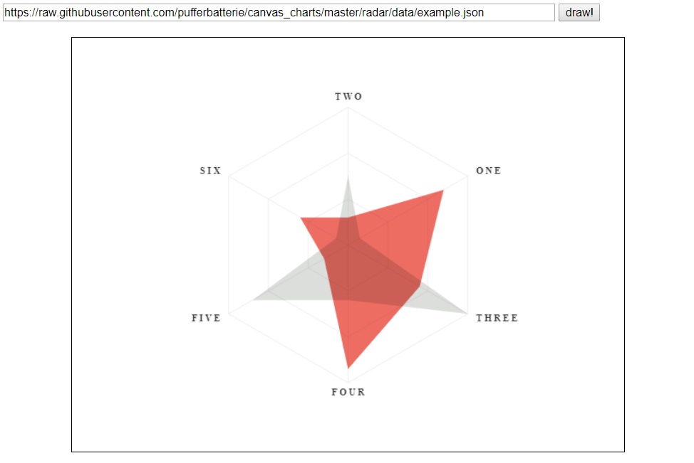

canvas_charts - radar
=====================

###### (HTML5/JS only chart generator)



By "Right Click -> Save image as" you can download a **transparent png** of the canvas 


data format
============
 
The order of the values in the "titles" array alignes the edges of the chart. 

from [./data/example.json](data/example.json)

```json
... 
    "titles": [
      "two",
      "one",
      "three",
      "four",
      "five",
      "six"
    ],
    "fills": [
      {
        "name": "not shown",
        "color": "#ececec",
        "data": {
          "one": 0.1,
          "two": 0.5,
          "three": 1,
          "four": 0.4,
          "five": 0.8,
          "six": 0.1
        }
      },
      {
        "name": "not shown",
        "color": "#ececec",
        "data": {
          "one": 0.8,
          "two": 0.2,
          "three": 0.6,
          "four": 0.9,
          "five": 0.2,
          "six": 0.4
        }
      }
    ]
  }
}
```

TODO
====

- respect colors from json
- option to show name field of each fill
- add a "download as png" button because it's the main purpose of the project 
- editor for data format
